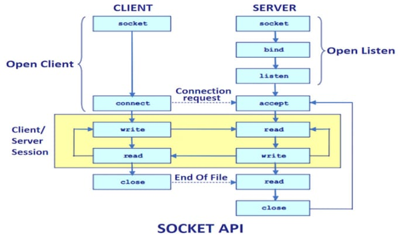
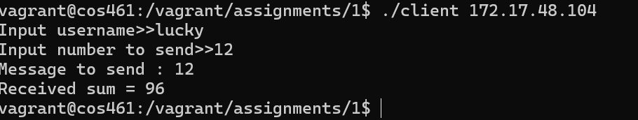

# Assignment 1

## Notes

---

Since I have included many “non-network” code snippets in my program. The literature below includes documentation for easy readability of the code.

## Server-side code

---

The code related to server is stored in `server.cpp` . To keep listening to clients forever an infinite loop has been inserted. To break the loop and close the socket `signal` command is used. 

```cpp
signal(SIGINT, ex);
```

This executes the function `ex()` when `Ctrl-c` is pressed. Function `x` includes code to close the socket and exit.

Since a tuple of data is passed from client to server that is the client’s name, and client’s number. I have decided to send the message in the format `<client_name:client_number>`.  To facilitate this `regexp` library is used to parse client’s name and client’s number from the message sent by server. 

```cpp
regex rgx(R"^<(\d+):([^:<>]+>$)")
```

The above regex matches the message from the server. *More on the regex :[https://en.cppreference.com/w/cpp/regex](https://en.cppreference.com/w/cpp/regex)*

In response to client the server gives back the sum without any standards, that is just the number.

Function `rand` is used to generate random numbers at the server side.

## Client-side code

---

The client side code is in `client.cpp`. I have decide to take in the IP address of the server using terminal arguments. That is the standard 

```cpp
int argc, char*argv[]
```

in the parameters of the main file. One must call the client program as `./client 172.17.17.1` where the IP address is the address of the server.

## Networking code

---

Both server side and client side programs have standard `socket` , `bind`, `recv` , `send` , `close` functions which enable socket programming. 



Image copied from the internet

## Demo

---

### Demo 1



Client Side


Server Side

### Demo 2

When the client number is greater than 100.


Client Side


Server Side
