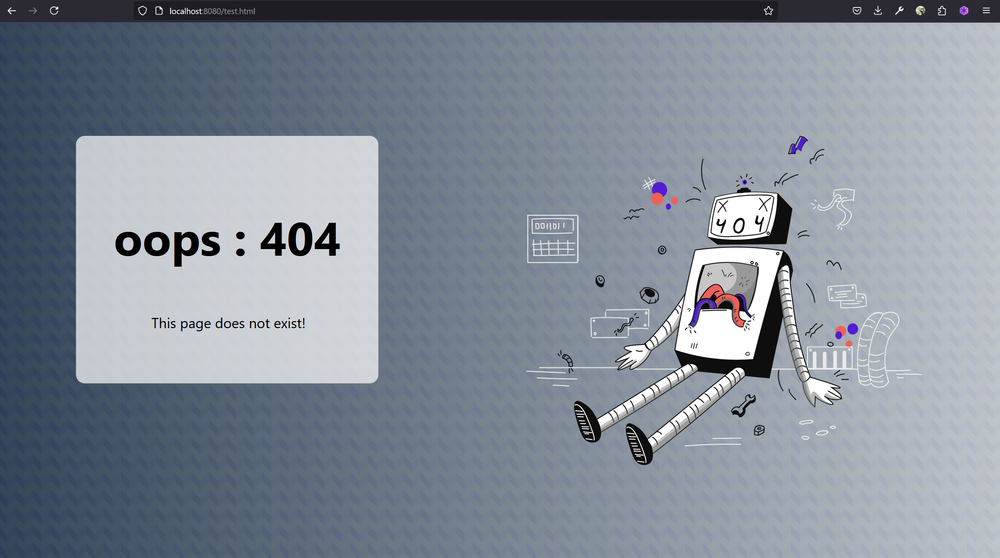

# Assignment 2


# Server.py


The server is stored in `/server` folder. It is written in Python. The static files which server hosts are stored in `/server/www` folder. It has a `static` folder which has the `404.html` which is server when the server cannot find the requested file in `/server/www` folder.




# Proxy


The proxy is written in C++. To compile `proxy.cpp` . Type :

```bash
g++ -std=c++14 ./socketp/exception.cpp ./socketp/socketp.cpp ./socketp/urls.cpp ./socketp/cache.cpp proxy.cpp -o proxy
```

I have seperated “helper functions” into `/socketp/exception.cpp` , `/socketp/socketp.cpp` , `/socketp/urls.cp`  and `/socketp/cache.cpp` . The file includes `socketp.h` to utilize the classes and functions in those files.  They contain various classes like `urls` , `socketp`  and `cache` which as the name suggests have functions managing the respective functions.


## Invoking the proxy

Start the proxy.

```bash
./proxy <port_number>
```

The port number is optional.

The proxy must be invoked using `GET` method. The website must be fetched the way below:


Here [`localhost:2004`](http://localhost:2004) is the address of the proxy followed by the address of the required url `localhost:8080/index.html`. 

*Note :* The proxy doesn’t resolve relative urls and my break when fetching additional files from the page.


## Caching Scheme
 

The caching technique is very simple. The server caches any new file in `/cache` folder. It cannot handle “BINARY” files. It stores the files in `.txt` format along with the headers.
